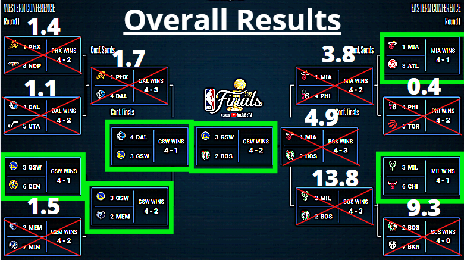

# NBA-2023-Win-Lose-Predictor
## Overview 
This project centered around a model that predicts the outcome of the NBA's next season. 205 Sports Solutions was founded in order to help NBA teams have a better idea of their future by the numbers in order to know what to expect with their future and thus set out the correct long term plan for success. In order to create our model we use data based on [ESPN](https://www.espn.com/nba/stats/player/_/season/2001/seasontype/2/table/offensive/sort/avgPoints/dir/desc), [nba.com](https://www.nba.com/stats/teams/boxscores/?Season=2021-22&SeasonType=Regular%20Season) and [Basketball-Reference.com](https://www.basketball-reference.com/teams/) from the 2001 to the 2022 NBA post-seasons and analyzed 1,821 games during that span. We used player rankings and expirence from pre-season and season games to determine the points that each team scored in a post-season game to determine the winner of that game.

## Table of Contents
- [Overview](#overview)
- [Business Problem](#business-problem)
- [Data Understanding](#data-understanding)
- [Methods](#methods)
- - [Data Preperation](#data-preperation)
- - [Modeling](#modeling)
- [Results](#results)
- [Conclusion](#conclusion)
- [Future Work](#future-work)
- [For More Information](#for-more-information)
- [Repository Structure](#repository-structure)


## Business Problem
We were hired by an anonymous gambler to create a model that can predict future outcomes of NBA games in regards to winning or losing. By doing so we can aid our stakeholders in accumulating more money through betting on NBA games.

## Data Understanding 
The data sets we used to create our models came from an [ESPN](https://www.espn.com/nba/stats/player/_/season/2001/seasontype/2/table/offensive/sort/avgPoints/dir/desc) database, [nba.com](https://www.nba.com/stats/teams/boxscores/?Season=2021-22&SeasonType=Regular%20Season) and data from [Basketball-Reference.com](https://www.basketball-reference.com/teams/). The data included 1,821 games from seasons between 2001-2022. We then combined the 3 data sets by player ranking, team, and game data which combined the player and team data sets which then allowed for the player rank to be next to each player and then we found each team in the game data sets and added in the player rankings. Thus, we used player ranking for a given position to determine the points that that team will score againnst another team. Our model uses player ranking to predict a games scores since ranking is based on the number of points a player scores on average for each game. Thus, ranking is a great predictor for post season games points since ranking is based on points scored in season games prior to the post season games. This means that overall our dataframe has 3642 rows and 43 columns.

## Methods


### Data Preperation
We began by turning all of the string nulls into the mean. We chose the mean because the ranking contained nulls, an upper and lower bound, and was continuous so there were no gaps in the rankings. Our dataframe that our model predicts on is the first and second best player rankings of a given position and how many years of expirence each player has on a given team, the team name, the opposing team name and there players position rankings and years of expirence. There is also a null indicator column used to indicate if a given team did not have a player for a given position that played atleast 70% of the games during the season. the next row would be the smae but the teams are switched.

### Modeling
Our decision tree was overfit and not 100% accurate. Decision trees can be 100% accurate but not if there isn't enough data. From this we can gather that we need to gather and implement more data if we want our score to improve from 9.4. Our max error was 45.5 on our train set and 39.5 on our test set which are both high. As we continue to try and improve this we can do this by decreasing mean squared error which as a result will also improve our max error. We have an explained variance of 0.28 which indicates that r=there is data that is not taken into account in this model. 

Our XGBoost model was an improvement overall upon our previous decision tree model as our mean square error was reduced by 0.5 points and as a result our max error dropped by 1 point. This is a desirable outcome, especially because our explained variance did not change. 

## Results



Above we can see how close we got to the actual 2022 bracket. The red Xs indicate what we got wrong with how far off we were written above. The green boxes are where our model predicted correctly. We can see that overall our model got 6 out of 15 correct but the matchups we got wrong most were fairly close. 

We can see that many of the games we got wrong was because our model does not take into account inactive players due to reasons such as injury, suspension, vaxination status, or otherwise.

## Conclusion
Despite our model needing some improvements, overall the model successfully predicted the bracket winner and was fairly close to predicitng the winners of each series and therefore should be considered a success.

## Future Work
Our model needs some improvements as far as the amount of data included and not taking into account for inactive players. Going forward we also plan to develop an app or website that is interactive and allows for individual matchup predictions and not just championship and series predictions.


## For More Information

- [ESPN](https://www.espn.com/nba/stats/player/_/season/2001/seasontype/2/table/offensive/sort/avgPoints/dir/desc)
- [nba.com](https://www.nba.com/stats/teams/boxscores/?Season=2021-22&SeasonType=Regular%20Season)
- [Basketball-Reference.com](https://www.basketball-reference.com/teams/)

## Repository Structure
```
├── Data                                    <- Data include to allow for use
|  ├── NBA Win-Loss.xlsx                    <- Initial NBA data W/L
|  ├── Team_bracket_2022.PNG                <- Team Bracket pic
|  ├── win_loss_completed_df.csv            <- completed NBA data W/L
|  ├── win_loss_df_seasonal.csv             <- Initial NBA season data W/L
|  ├── win_loss_seasonal_completed_df.csv   <- completed NBA season data W/L (Not Finished)
|  ├── year_position.pickle                 <- dict of positions given year
|  └──year_team.pickle                      <- dict of teams given year
├── Repos
|  ├── Connor Repo
|  |  ├── Bracket.ipynb                     <- Notebook: create bracket
|  |  ├── Connor Repo.ipynb                 <- Notebook: initial looking at and collecting data
|  |  ├── ModelingNotebook.ipynb            <- Notebook: Modeling
|  |  ├── More data.ipynb                   <- Notebook: collecting more date
|  |  ├── Sandbox.ipynb                     <- Notebook: Sandbox
|  |  └── position_ranking.py               <- created py
|  ├── James Repo
|  |  └── James Repo.ipynb                  <- Notebook: Modeling
├── .gitignore                              <- Basic git ignore
├── Final Notebook.ipynb                    <- Final notebook
├── NBA-2023-Win-Lose-Predictor.pdf         <- pdf of presentation slides
└── README.md                               X- You Are Here
```
